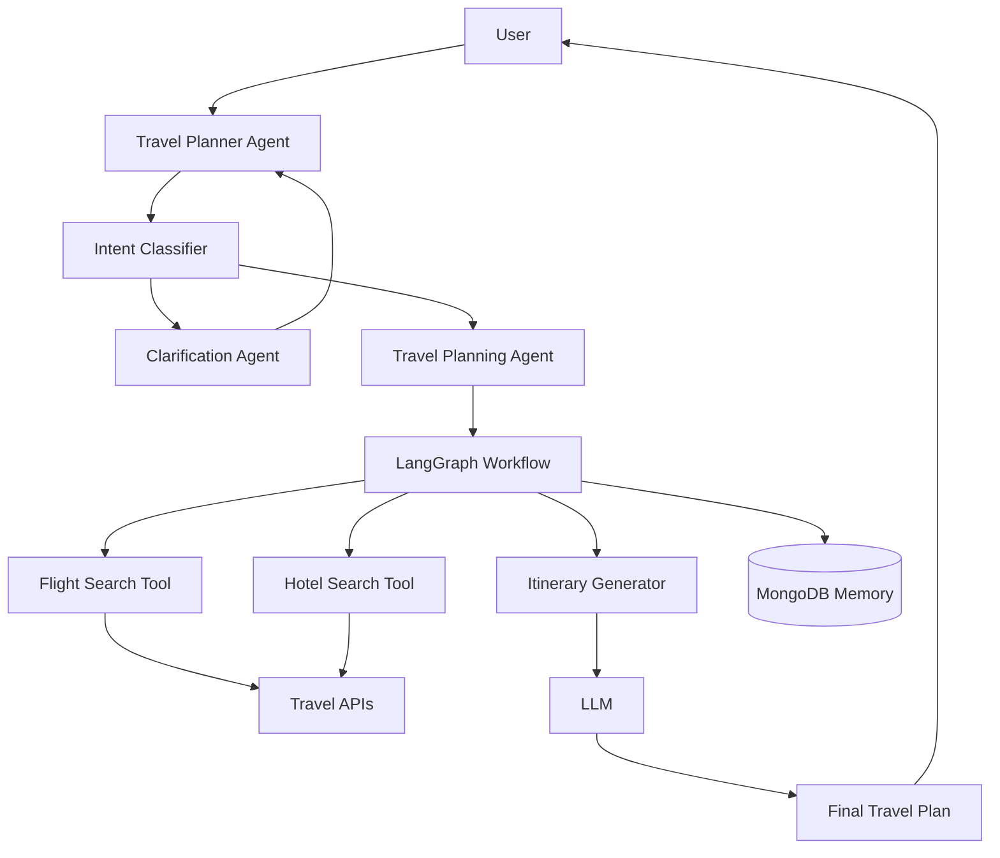
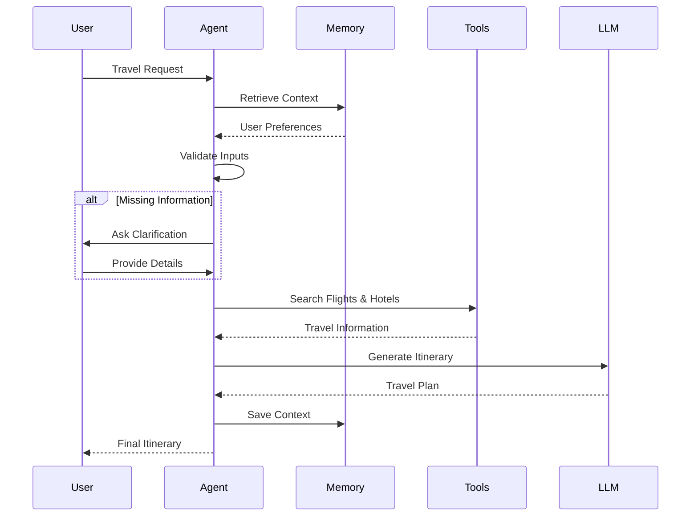

# ✈️ Travel Planner Agent

An AI-powered travel planning assistant that creates personalized travel itineraries based on user preferences, budget, travel dates, destinations, and interests. The agent leverages LLMs, LangGraph workflows, memory, and travel APIs to provide intelligent and interactive trip planning.

## 🚀 Features

- 🗺️ Personalized itinerary generation
- ✈️ Flight recommendations
- 🏨 Hotel suggestions
- 💰 Budget-aware planning
- 🧠 AI-powered travel assistant
- 🔄 Multi-turn conversations
- 💾 Persistent memory using MongoDB
- ❓ Dynamic clarification for missing details
- 📅 Day-wise itinerary generation
- 🌍 Multi-destination support
- 🔌 Tool-based architecture

## 🏛️ Architecture



## 🔄 Workflow



## 🧩 Agent Flow

### Intent Classification

Determines whether the user is:

- Planning a new trip
- Modifying an existing itinerary
- Requesting recommendations
- Asking travel-related questions

### Clarification Flow

Collects missing information such as:

- Destination
- Travel dates
- Budget
- Number of travelers
- Interests and preferences

### Planning Engine

Generates:

- Day-wise itinerary
- Flight suggestions
- Hotel recommendations
- Activity recommendations

### Memory Layer

Stores:

- Previous conversations
- Travel preferences
- Existing itineraries

Enabling users to continue planning from where they left off.

## 🏗️ Tech Stack

| Component | Technology |
|------------|------------|
| Workflow Engine | LangGraph |
| LLM Framework | LangChain |
| Language | Python |
| Database | MongoDB |
| Memory | MongoDB Checkpointer |
| Validation | Pydantic |
| APIs | Aviation & Travel APIs |
| Environment | Python Virtual Environment |

## 📂 Project Structure

```text
travel-planner-agent/
│
├── agents/
│   ├── planner_agent.py
│   ├── classifier_agent.py
│   └── clarification_agent.py
│
├── tools/
│   ├── flight_search.py
│   ├── hotel_search.py
│   └── itinerary_generator.py
│
├── graphs/
│   └── travel_graph.py
│
├── memory/
│   └── mongodb_checkpointer.py
│
├── prompts/
│
├── models/
│
├── main.py
│
├── requirements.txt
│
└── README.md
```

## ⚙️ Installation

### Clone Repository

```bash
git clone https://github.com/shashankbhavusar/travel-planner-agent.git

cd travel-planner-agent
```

### Create Virtual Environment

```bash
python -m venv venv
```

### Activate Virtual Environment

#### Windows

```bash
venv\Scripts\activate
```

#### Linux / Mac

```bash
source venv/bin/activate
```

### Install Dependencies

```bash
pip install -r requirements.txt
```

## 🔑 Environment Variables

Create a `.env` file:

```env
OPENAI_API_KEY=

MONGODB_URI=

AVIATION_API_KEY=

HOTEL_API_KEY=
```

## ▶️ Running the Application

```bash
python main.py
```

## 💡 Example Query

```text
Plan a 5-day trip to Goa for 2 people.

Budget: ₹40,000
Travel Dates: July 10 - July 15
Interests: Beaches, Nightlife, Water Sports
```

## 📋 Example Output

```text
Day 1
- Arrival in Goa
- Hotel Check-in
- Sunset at Calangute Beach

Day 2
- Water Sports at Baga Beach
- Explore Anjuna Market

Day 3
- Dudhsagar Falls
- Spice Plantation Tour

Day 4
- Old Goa Churches
- River Cruise

Day 5
- Local Shopping
- Departure
```

## 🔮 Future Enhancements

- Real-time flight pricing
- Real-time hotel availability
- Weather-aware itinerary planning
- Google Maps integration
- Expense tracking
- Voice-enabled travel assistant
- Multi-agent trip planning
- Travel document management

## 🤝 Contributing

1. Fork the repository

2. Create a feature branch

```bash
git checkout -b feature/new-feature
```

3. Commit your changes

```bash
git commit -m "Add new feature"
```

4. Push the branch

```bash
git push origin feature/new-feature
```

5. Open a Pull Request

## 📄 License

This project is licensed under the MIT License.

## 👨‍💻 Author

**Shashank H T**

GitHub: https://github.com/shashankbhavusar

---
